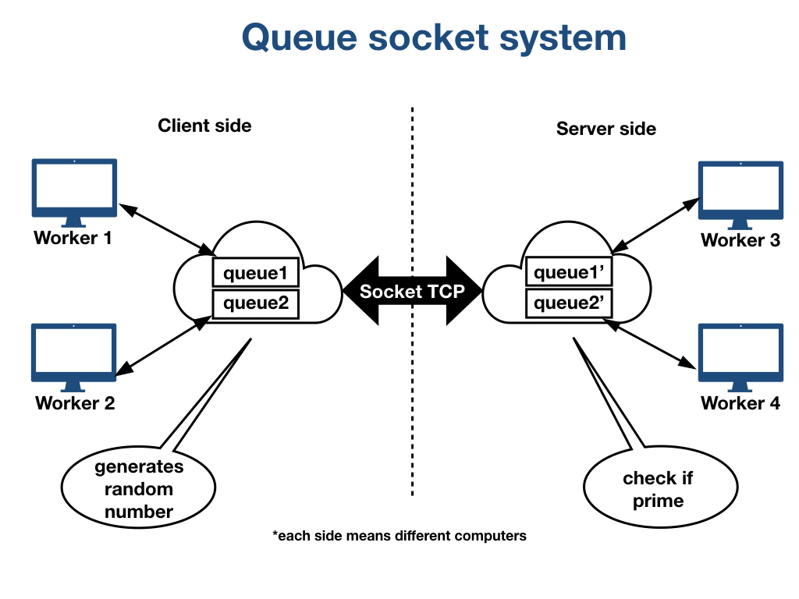

# Queue socket system
Code to Distributed Systems that control 4 works, 2 clients and 2 servers. The Clients send a random number to which queue and the Server read this queue too check if this number is prime.

# Rows

 - The Worker 1 and 2 generates random numbers and send to their queues (queue 1 and 2). These queues are stored in the client controller.

 - The Client controller start a connection with the server and to send witch elements of the queue to the Server controller.

 - The Server controller get the numbers and put on the correspondent queues (queue 1' and 2')

 - The Workers 3 and 4 get the numbers from their queue (1' for Worker 3 and 2' for the Worker 4), check if the number is prime and print on the screen.

 - The connection between the Client and the Server is TCP socket.

You can see the Architectural scheme below

